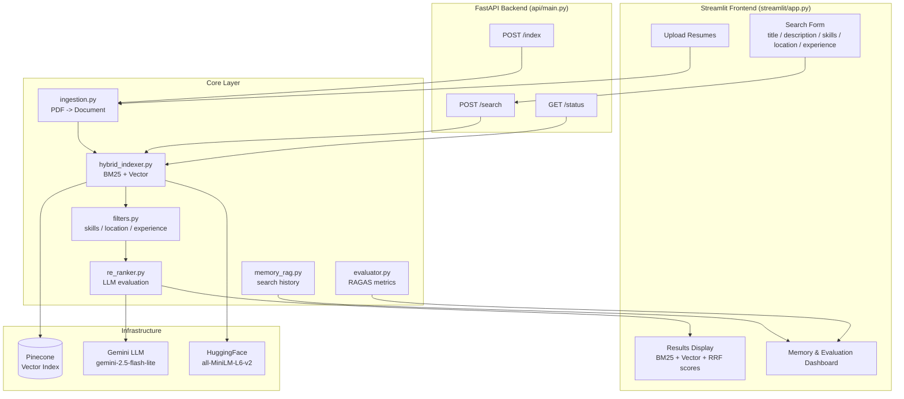
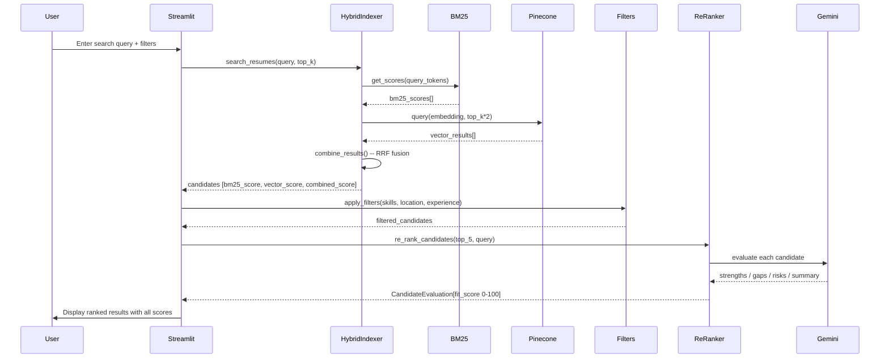

# HireFlow System Architecture

## Overview

HireFlow is a resume-only AI candidate search engine. It indexes PDF resumes using both BM25 (lexical) and Pinecone vector (semantic) search, fuses results with Reciprocal Rank Fusion (RRF), applies post-search filters, and optionally re-ranks candidates with a Gemini LLM evaluator.

The system is split into a **FastAPI backend** (handles indexing and search) and a **Streamlit frontend** (handles UI). Both can run independently.

---

## System Diagram



---

## Data Flow



---

## Scoring Pipeline

```
Resume text
    |
    +---> BM25 (rank_bm25)
    |         BM25 raw score
    |         normalized to [0,1]: score / max_score
    |
    +---> Pinecone (cosine similarity)
              Vector score in [0,1]
    |
    v
Reciprocal Rank Fusion (RRF)
    rrf_score = 1 / (60 + rank)
    candidates in both lists get scores summed
    |
    v
combined_score (RRF) -- used for initial ranking
    |
    v
Post-Search Filters (optional)
    skills / location / min_experience
    |
    v
LLM Re-Ranking (optional, top-5 only)
    fit_score = 50 + strength_score(max 30) - gap_penalty(max 40)
    clamped to [0, 100]
```

---

## Component Descriptions

| Component | File | Responsibility |
|---|---|---|
| FastAPI Backend | `api/main.py` | REST endpoints for index/search/status |
| HybridIndexer | `core/hybrid_indexer.py` | Orchestrates BM25 + Pinecone + RRF |
| VectorStore | `core/vector_store.py` | Pinecone upsert and query |
| Ingestion | `core/ingestion.py` | PDF -> LangChain Document |
| ResumeParser | `core/parsing.py` | LLM-based structured field extraction |
| ReRanker | `core/re_ranker.py` | Gemini evaluation with weighted scoring |
| Filters | `core/filters.py` | Post-search filtering (skills/location/exp) |
| MemoryRAG | `core/memory_rag.py` | LangChain conversation memory |
| SearchRouter | `core/search_router.py` | Routes to shallow or deep search strategy |
| RAGEvaluator | `core/evaluator.py` | RAGAS quality metrics |
| SearchQuery | `utils/schemas.py` | Lightweight query context dataclass |
| Resume | `utils/schemas.py` | Pydantic resume model |
| CandidateEvaluation | `utils/schemas.py` | Pydantic evaluation result model |

---

## Re-Ranker Scoring Detail

### LLM path (Gemini available)
```
1. Gemini extracts: 3 strengths, 3 gaps, any risks, summary
2. For each item in strengths/gaps:
   - positional_weight = (n - i) / n  (first item = highest weight)
   - skill_match_weight = positional bonus if item matches a required skill
   - experience_bonus = +0.2 if item mentions "experience"/"years"/"senior"
3. strength_score = aggregate(strengths, max=30, is_gap=False)
4. gap_penalty   = aggregate(gaps, max=40, is_gap=True)
5. fit_score = clamp(50 + strength_score - gap_penalty, 0, 100)
```

### Fallback path (LLM unavailable)
```
fit_score = 50 + (20 * n_strengths) - (15 * n_gaps)
clamped to [0, 100]

Strengths: candidate has required skills
Gaps:      candidate missing required skills
```

---

## Startup Behaviour (Streamlit)

On cold start, `SystemManager.initialize()`:
1. Initialises Pinecone and embeddings
2. Checks `vector_store.get_stats()["total_vector_count"]`
3. **If > 0**: rebuilds BM25 from local PDFs only (skips Pinecone upsert)
4. **If 0**: runs full indexing (BM25 + Pinecone upsert)

A **Force Re-index Resumes** button in the sidebar triggers a full re-index at any time.

---

## Running Tests

```bash
pytest tests/ -v
```

All tests use `unittest.mock` — no live Pinecone or Gemini calls.

| Test file | Covers |
|---|---|
| `tests/test_filters.py` | skills / location / experience filtering |
| `tests/test_hybrid_indexer.py` | BM25 indexing, RRF fusion, score normalization |
| `tests/test_re_ranker.py` | LLM evaluation, rule-based fallback, section parsing |
| `tests/test_ingestion.py` | PDF loading, metadata extraction, DocumentProcessor |
